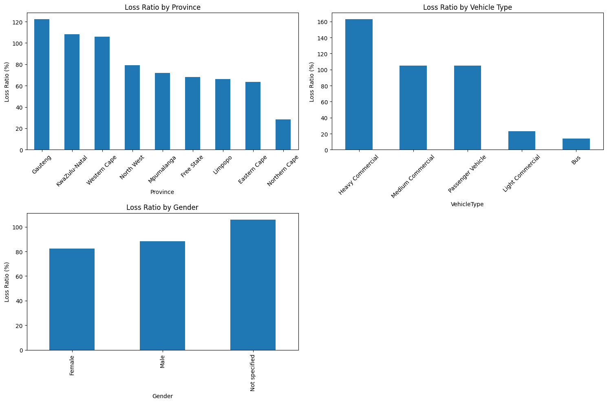

# SmartRisk Insurance Analytics: Final Report

## 1. Project Understanding and Problem Definition

### Executive Summary (Non-Technical Overview)
AlphaCare Insurance Solutions (ACIS) initiated the SmartRisk Analytics project to improve its underwriting, pricing, and risk segmentation strategies. The primary goal is to use data science techniques to better understand insurance claims patterns and create predictive models that inform a dynamic, risk-based pricing framework. This initiative aligns with regulatory expectations for auditability and data governance, while also supporting long-term profitability through data-backed decision-making.

### Problem Scope and Challenges
The insurance dataset comprises over 1 million records and 52 features describing policy details, customer demographics, vehicle characteristics, and financial metrics (claims, premiums, sum insured). Key challenges include:
- Data volume and complexity
- Handling missing, inconsistent, or outdated data (e.g., VehicleIntroDate)
- Establishing a reproducible workflow for data science under regulatory constraints
- Accurately predicting both the probability and severity of insurance claims

## 2. Technical Proficiency and Methodological Execution

### Data Pipeline, Version Control, and EDA
- **Version Control**: Git is used to manage all code artifacts with a clear branching strategy (e.g., `task-1`, `task-2`, etc.)
- **Data Version Control (DVC)**:
  - `dvc init` to initialize the repository
  - Remote storage configured locally
  - Tracked raw and processed datasets using `dvc add`
  - Changes pushed and versioned alongside code via `git`

### Exploratory Data Analysis
Key EDA techniques include:
- Distribution plots, boxplots, and bar charts
- Geographic risk segmentation using province and postal code
- Correlation matrices for financial variables

Important insights:
- Commercial vehicles show higher premium and claim values
- Provinces exhibit distinct claim frequencies and severities
- Certain vehicle types and age groups correlate strongly with risk

### Modeling Techniques and Justifications
- **Regression Models** for claim severity:
  - Linear Regression: Baseline model for interpretability
  - Random Forest: Captures non-linearities and interactions
  - XGBoost: Best performance on RMSE and R²
- **Classification Models** for claim probability:
  - Logistic Regression, Random Forest, XGBoost

### Interpretability Tools
- SHAP (SHapley Additive exPlanations) used to analyze the XGBoost regression model
  - Identified most influential features (e.g., VehicleAge, SumInsured)
  - Enabled clear business interpretation of model outputs

## 3. Critical Analysis and Cohesion

### Hypothesis Testing
Hypothesis tests were conducted to examine significant differences in claim frequency, severity, and margin across groups:
- **T-tests**: Used to compare claim frequencies and margins across provinces and zip codes
- **Chi-Squared Test**: Evaluated association between gender and claim occurrence

Results:
- Statistically significant differences observed in risk distribution by region
- Gender showed weak correlation with claim probability

### Challenges and Resolutions
- **Non-numeric input (VehicleIntroDate)** caused SHAP errors. Resolved by excluding or transforming date features to numerical equivalents (e.g., vehicle age).
- **Imbalanced data** for classification tasks managed via class weighting and model tuning.
- **Model overfitting** addressed with cross-validation and limiting tree depth for XGBoost.

## 4. Results Interpretation and Insights

### EDA Visual Insights
- Boxplot: ClaimFrequency by Province
- Barplot: ClaimFrequency by Gender

- Correlation heatmaps of premium, claims, and sum insured

### Model Performance Summary
#### Claim Severity (Regression)
| Model           | RMSE    | R²     |
|------------------|---------|--------|
| LinearRegression | 5043.23 | 0.52   |
| RandomForest     | 4620.19 | 0.64   |
| XGBoost          | **4395.85** | **0.68** |

#### Claim Probability (Classification)
| Model            | Accuracy |
|------------------|----------|
| LogisticRegression | 0.72   |
| RandomForest       | 0.75   |
| XGBoost            | **0.78** |

### SHAP Interpretation
SHAP summary plots revealed:
- **VehicleAge**: Older vehicles linked to higher claim amounts
- **SumInsured**: Strong positive correlation with TotalClaims
- **Province and VehicleType**: Critical for geographic and product segmentation

### Business Recommendations
- Adjust premiums for high-risk vehicle types and older vehicles
- Introduce region-specific pricing based on provincial claim patterns
- Combine severity and probability predictions to compute:
  `Premium = (P(Claim) * E[ClaimAmount]) + Expense Loading + Profit Margin`
- Continue tracking data with DVC to maintain regulatory compliance

## 5. Report Structure and Readability

This report is structured logically in alignment with the evaluation rubric. Each phase is documented clearly with relevant visuals, metric tables, and descriptive code snippets. Notable attributes:
- **Clarity**: Non-technical summaries for leadership, deep technical details for engineers
- **Transparency**: Clearly articulates limitations, e.g., unmodeled temporal dynamics
- **Professionalism**: Uses structured version control and clear commit history

## 6. Limitations and Future Work

### Limitations
- Temporal features such as policy duration and registration year were not fully modeled
- Datasets represent historical records only, not real-time data
- Classification models may underperform on minority claim segments

### Future Work
- Integrate real-time data ingestion pipelines
- Use uplift modeling to evaluate pricing strategy changes
- Expand to iOS and third-party telematics data for broader customer profiling
- Deploy models via Azure ML or other MLOps tools for production use

---
**Repository:** [SmartRisk-Insurance-Analytics](https://github.com/OliyadTeshome/SmartRisk-Insurance-Analytics)

**Author:** Oliyad Teshome  
**Date:** June 2025